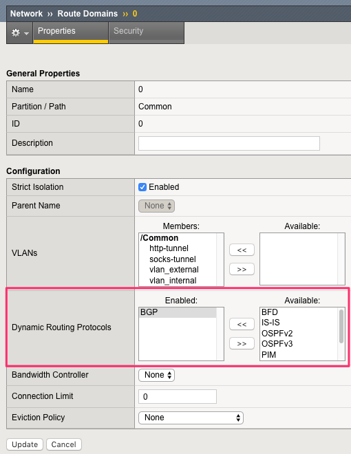

.. raw:: html

   

.. role:: red

.. raw:: html

   

.. role:: blue

F5 BigIP BGP Set Up
===================

**From bigip TMUI (10.1.20.5)**

We will use our self IPs on the internal network. Therefore we need to make sure of the following:

* The self IP has a portlock down setup to "Allow All"
* Or add a TCP custom port to the self IP: TCP port 179

You need to allow BGP on the default route domain 0 on your BIG-IPs. 
Connect to the BIG-IP GUI on go into Network > Route domain. Click on Route Domain "0" and allow BGP.

========  ========  ==========
 Device   Username   Password
========  ========  ==========
 bigip     admin    f5twister!
========  ========  ==========

Click on **Update**

Once this is done, connect via SSH and get into a bash shell.

**From bigip CLI (10.1.20.5)**

Run the following commands::

   #access the IMI Shell
   imish

   #Switch to enable mode
   enable

   #Enter configuration mode
   config terminal
   #Setup route bgp with AS Number 64512
   router bgp 64512

   #Create BGP Peer group
   neighbor calico-k8s peer-group

   #assign peer group as BGP neighbors
   neighbor calico-k8s remote-as 64512

   #we need to add all the peers: the other BIG-IP, our k8s components
   neighbor 10.1.20.20 peer-group calico-k8s
   neighbor 10.1.20.21 peer-group calico-k8s
   neighbor 10.1.20.22 peer-group calico-k8s

   #save configuration
   write

   #exit
   end

.. toctree::
   :numbered:
   :hidden:
   :caption: Chapter 2 - set up BGP

   Introduction <BGP/introduction>
   Calico - BGP <BGP/calico-bgp>
   F5 BigIP - BGP <BGP/bigip-bgp>
   BGP - Verification <BGP/bgp-verify>