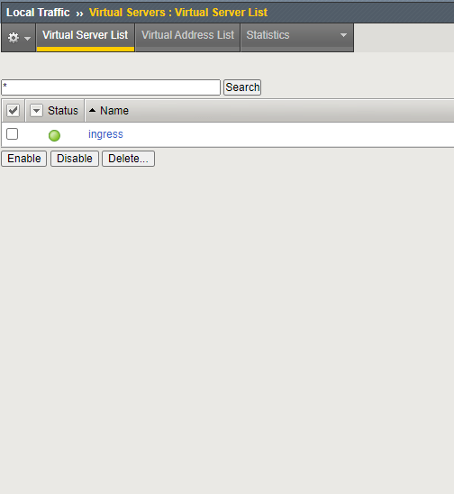
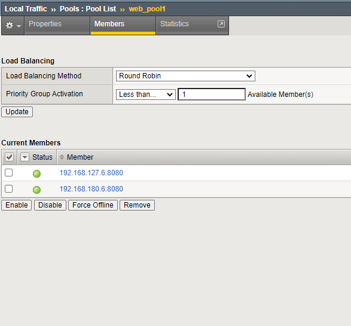

AS3 -- Config Maps
==================

In the previous chapter, we looked at deploying *simple* ingress service (from a definition point of view).
Now we'll have a look into config maps / as3.

Using this method, we allow a lot of more flexibility, as we allow AS3 definitions. The drawback is an increase of config-complexity.

First and foremost update to current github repository (if not already done)::

  ubuntu@kube-master:~$ /home/ubuntu/update_repo.sh
  A    k8s
  A    k8s/apps
  A    k8s/apps/README.md
  A    k8s/calico
  A    k8s/calico/README.md
  A    k8s/calico/calicoctl
  A    k8s/calico/calicoctl/BGPConfiguration
  A    k8s/calico/calicoctl/BGPPeer
  A    k8s/istio
  A    k8s/istio/README.md
  Exported revision 54.

The lenght of the list may vary, depending on the amout of scripts/files downloaded.

* First change folder to  /home/ubuntu/k8s/apps::

   cd /home/ubuntu/k8s/apps

* Deploy *hello_world_as3.yaml* app::

    ubuntu@kube-master:~/k8s/apps$ kubectl apply -f hello_world_as3.yaml
    deployment.apps/f5-hello-world-web1 created
    service/f5-hello-world-web1 created

* And check the running PODs::

    ubuntu@kube-master:~/k8s/apps$ kubectl get pods
    NAME                                   READY   STATUS    RESTARTS   AGE
    coffee-5f56ff9788-bns29                1/1     Running   1          11h
    coffee-5f56ff9788-fp89s                1/1     Running   1          11h
    coffee-5f56ff9788-z8pqx                1/1     Running   1          11h
    f5-hello-world-web1-79d96c659b-dszf6   1/1     Running   0          70s
    f5-hello-world-web1-79d96c659b-wlkqs   1/1     Running   0          70s
    tea-69c99ff568-bzscp                   1/1     Running   0          110m
    tea-69c99ff568-xmncd                   1/1     Running   0          110m

Now we'll add a config map declaration.

* Change to folder /home/ubuntu/k8s/config-map::

    cd /home/ubuntu/k8s/config-map

* Apply Config-Map::

    ubuntu@kube-master:~/k8s/config-map$ kubectl apply -f as3-1_configmap.yaml
    configmap/f5-as3-declaration1 created

    ubuntu@kube-master:~/k8s/config-map$ kubectl get configmap
    NAME                  DATA   AGE
    f5-as3-declaration1   1      7m17s

Within this config map, we provide a full AS3 call::

        {
            "class": "AS3",
            "declaration": {
                "class": "ADC",
                "schemaVersion": "3.10.0",
                "id": "urn:uuid:33045210-3ab8-4636-9b2a-c98d22ab915d",
                "label": "http",
                "remark": "Simple HTTP application with RR pool",
                "AS3_1": {
                    "class": "Tenant",
                    "A1": {
                        "class": "Application",
                        "template": "generic",
                        "ingress": {
                            "class": "Service_HTTP",
                            "virtualAddresses": [
                                "10.1.10.83"
                            ],
                            "pool": "web_pool1"
                        },
                        "web_pool1": {
                            "class": "Pool",
                            "monitors": [
                                "http"
                            ],
                            "members": [
                                {
                                    "servicePort": 8080,
                                    "serverAddresses": []
                                }
                            ]
                        }
                    }
                }
            }
        }

Log in to bigip and check the service.

.. warning::
   Since AS3 uses partition, you need to change to the appropriate partition.
   When you check the config-map, you'll see that we use **AS3_1**

Virtual Server:

Pool:

When finished, delete the deployment again::

    ubuntu@kube-master:~/k8s/config-map$ kubectl delete configmap f5-as3-declaration1
    configmap "f5-as3-declaration1" deleted

    ubuntu@kube-master:~/k8s/config-map$ kubectl get configmap
    No resources found in default namespace.

.. toctree::
   :hidden:
   :caption: Chapter 4 - AS3 / Config-Map

   Introduction <as3/introduction>
   Config Map <as3/config-map>