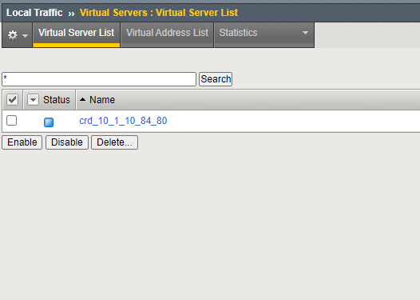

Deploy Apps
-----------

Now we start deploying CRD services.
We'll set up a basic http service - as well as a basic https service.

* Change folder to crd folder /home/ubuntu/k8s/crd::

    cd /home/ubuntu/k8s/crd

|
|

Simple HTTP Service
+++++++++++++++++++

* Deploy *simple_http.yaml* Service::

    ubuntu@kube-master:~/k8s/crd$ kubectl apply -f simple_http.yaml
    virtualserver.cis.f5.com/cafe-virtual-server created

* Verify if the service is running::

    ubuntu@kube-master:~/k8s/crd$ kubectl get virtualserver
    NAME                  AGE
    cafe-virtual-server   10s

Now check if the CRD is applied to the bigip successfully.

Log in to bigip via TMUI.

Virtual Server:

LTM Policy:

.. image:: ../images/crd-LTMpol.PNG
   :width: 400
   :alt: Lab Overview
   :align: center

and Pool-Member:

When finished with analyzing and testing the service, delete the CRD, again.

* delete the service again::

    ubuntu@kube-master:~/k8s/crd$ kubectl delete virtualserver cafe-virtual-server
    virtualserver.cis.f5.com "cafe-virtual-server" deleted

|
|

Simple HTTPs Service
++++++++++++++++++++

To set up TLS Services, we need to deploy a TLS service before.

* Deploy *TLSprofile-edge.yaml* Service::

    ubuntu@kube-master:~/k8s/crd$ kubectl apply -f TLSprofile-edge.yaml
    tlsprofile.cis.f5.com/edge-tls created

|

Once done, we can add the service itself.

* Deploy *simple_https.yaml* Service::

    ubuntu@kube-master:~/k8s/crd$ kubectl apply -f simple_https-edge.yaml
    virtualserver.cis.f5.com/cafe-virtual-server created

Now check if the CRD is applied to the bigip successfully.

Log in to bigip via TMUI

Virtual Server:

LTM SSL Profile:

When done, delete virtualserver and tlsprofile::

    ubuntu@kube-master:~/k8s/crd$ kubectl get virtualserver
    NAME                  AGE
    cafe-virtual-server   76m
    
    ubuntu@kube-master:~/k8s/crd$ kubectl delete virtualserver cafe-virtual-server
    virtualserver.cis.f5.com "cafe-virtual-server" deleted
    
    
    ubuntu@kube-master:~/k8s/crd$ kubectl get tlsprofile
    NAME       AGE
    edge-tls   82m
    
    ubuntu@kube-master:~/k8s/crd$ kubectl delete tlsprofile edge-tls
    tlsprofile.cis.f5.com "edge-tls" deleted

.. toctree::
   :hidden:
   :caption: Chapter 5 - Custom Ressource Definition

   Introduction <crd/introduction>
   New CIS Instance <crd/crd-cis>
   Import CRD Definition <crd/crd-crd>
   Create Services <crd/crd-deploy>
