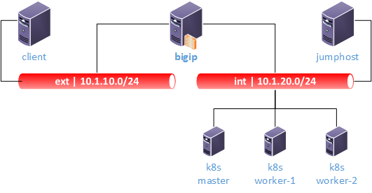

Kubernetes Training Lab
=======================

Welcome to my Lab Guide for integrating F5 Container Ingress Services with k8s and Calico as CNI.

**Purpose:** This lab is for getting familiar and test basic kubernetes ingress services and start working with istio service mesh - from a f5 point of view (bigip CIS & NGINX Ingress).

The lab has following basic set up:

========  ========  ===========  ===========
 Device    IP MGMT   IP ext.      IP int.
========  ========  ===========  ===========
 bigip    10.1.1.4  10.1.10.5    10.1.20.5
 master   10.1.1.5  n/a          10.1.20.20
worker-1  10.1.1.6  n/a          10.1.20.21
worker-2  10.1.1.7  n/a          10.1.20.22
jumphost  10.1.1.8  n/a          10.1.20.200
client    10.1.1.9  10.1.10.200  n/a
========  ========  ===========  ===========

*Since MGMT IP is required by the lab network, but not really used in our example, it will be ignored*

The lab runs currently on:

* TMOS 15.1
   * AS3 XYZ

* Ubuntu 18.04
   * kubernetes 18.

The infrastructure is set up (VLANs and IPs) and basic kubernetes installation is completed.

.. warning::
   
   Since it is important for initilazing the calico sdn, please be aware, that k8s was initialized with *"--pod-network-cidr=192.168.0.0/16"*

From that point on, infrastrucure needs to be initialized (calico service, app deplyoments, services, ...).

* **Chapter 1** focuses on basic information about the lab, kubernetes, calico and so on.

* **Chapter 2** finishes the calico installation and basic BGP set up
   * **Chapter 2.1** shows how to deploy basic kubernetes ingress services and auto-configure the bigip (Contianer Ingress Service - CIS)
   * **Chapter 2.2** shows how to integrate NGINX Ingress Services and use f5 CIS-NGINX Controller to use f5 big ip and nginx ingress (Project Chimera)
   * **Chapter 2.3** advance usage of F5 and NGINX Ingress Services

* **Chapter 3** installs ISTIO and uses f5 for external facing services

**Please use the menu on the left, to jump to the desired chapter**

.. toctree::
   :hidden:
   :caption: Chapter 1 - Information

   Introduction <learning/introduction>
   Calico <learning/calico>
   ISTIO <learning/istio>

.. toctree::
   :hidden:
   :caption: Chapter 2 - kubernetes ingress

   Introduction <k8s-ingress/introduction>
   Calico - BGP <k8s-ingress/calico-bgp>

.. toctree::
   :numbered:
   :hidden:
   :caption: Chapter 3 - istio
   
   Introduction <istio/introduction>