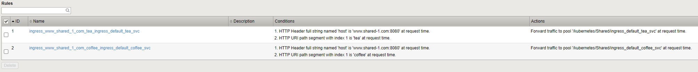
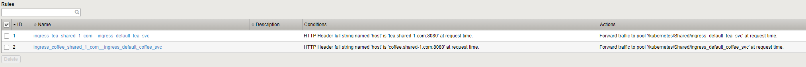

Layer-7 Ingress Routing
=======================

In this lab we'll check how Layer-7 Routing works.
For this we set up several Ingress Ressources - all using the same IP and/ using paths to route traffic.

First and foremost update to current github repository (if not already done)::

  ubuntu@kube-master:~$ /home/ubuntu/update_repo.sh
  A    k8s
  A    k8s/apps
  A    k8s/apps/README.md
  A    k8s/calico
  A    k8s/calico/README.md
  A    k8s/calico/calicoctl
  A    k8s/calico/calicoctl/BGPConfiguration
  A    k8s/calico/calicoctl/BGPPeer
  A    k8s/istio
  A    k8s/istio/README.md
  Exported revision 54.

The lenght of the list may vary, depending on the amout of scripts/files downloaded.

* We'll detelte existing ingress services, to have a clean install::

        ubuntu@kube-master:~/k8s/basic-ingress$ kubectl get ingress
        NAME             CLASS    HOSTS                 ADDRESS      PORTS     AGE
        singleingress1   <none>   *                     10.1.10.80   80        10h
        singleingress2   <none>   www.adv-ingress.com   10.1.10.81   80, 443   16m
        
        ubuntu@kube-master:~/k8s/basic-ingress$ kubectl delete ingress singleingress1
        ingress.extensions "singleingress1" deleted
        ubuntu@kube-master:~/k8s/basic-ingress$ kubectl delete ingress singleingress2
        ingress.extensions "singleingress2" deleted

* Check that coffee and tea service are still runnung::

        ubuntu@kube-master:~/k8s/basic-ingress$ kubectl get deployment
        NAME     READY   UP-TO-DATE   AVAILABLE   AGE
        coffee   3/3     3            3           11h
        tea      2/2     2            2           56m

* Change folder to /home/ubuntu/k8s/basic-ingress::

    cd /home/ubuntu/k8s/basic-ingress

L7 Routing
++++++++++

Deploy the shared-ingress-1.yaml service::

    ubuntu@kube-master:~/k8s/basic-ingress$ kubectl apply -f shared-ingress-1.yaml
    ingress.extensions/sharedingress1 created

Check the LTM Routing Policy - and compare it with the .yaml config file::

        spec:
        rules:
        - host: www.shared-1.com
            http:
            paths:
            - path: /coffee
                backend:
                serviceName: coffee-svc
                servicePort: 80
            - path: /tea
                backend:
                serviceName: tea-svc
                servicePort: 80

Compare to:

When finished, delete ingress delclaration::

        ubuntu@kube-master:~/k8s/basic-ingress$ kubectl get ingress
        NAME             CLASS    HOSTS              ADDRESS      PORTS   AGE
        sharedingress1   <none>   www.shared-1.com   10.1.10.82   80      3m36s
        
        ubuntu@kube-master:~/k8s/basic-ingress$ kubectl delete ingress sharedingress1
        ingress.extensions "sharedingress1" deleted
        ubuntu@kube-master:~/k8s/basic-ingress$

Host-Routing
++++++++++++

* deploy shared-ingress-2.yaml service::

    ubuntu@kube-master:~/k8s/basic-ingress$ kubectl apply -f shared-ingress-2.yaml
    ingress.extensions/sharedingress2 created

    ubuntu@kube-master:~/k8s/basic-ingress$ kubectl get ingress
    NAME             CLASS    HOSTS                                  ADDRESS      PORTS   AGE
    sharedingress2   <none>   coffee.shared-1.com,tea.shared-1.com   10.1.10.82   80      25s

Check the LTM Routing Policy - and compare it with the .yaml config file::

    - host: coffee.shared-1.com
        http:
        paths:
        - path: /
            backend:
            serviceName: coffee-svc
            servicePort: 80
    - host: tea.shared-1.com
        http:
        paths:
        - path: /
            backend:
            serviceName: tea-svc
            servicePort: 80

Compare to:

When finished, delete ingress delclaration::

    ubuntu@kube-master:~/k8s/basic-ingress$ kubectl get ingress
    NAME             CLASS    HOSTS                                  ADDRESS      PORTS   AGE
    sharedingress2   <none>   coffee.shared-1.com,tea.shared-1.com   10.1.10.82   80      25s

    ubuntu@kube-master:~/k8s/basic-ingress$ kubectl delete ingress sharedingress2
    ingress.extensions "sharedingress2" deleted

.. toctree::
   :numbered:
   :hidden:
   :caption: Chapter 3 - Ingress Service

   Introduction <k8s-ingress/introduction>
   Container Ingress Service <k8s-ingress/cis>
   Basic Ingress <k8s-ingress/basic-ingress>
   Basic Ingress - TLS <k8s-ingress/basic-ingress-tls>
   Basic Ingress - L7 Routing <k8s-ingress/basic-ingress-l7-route>