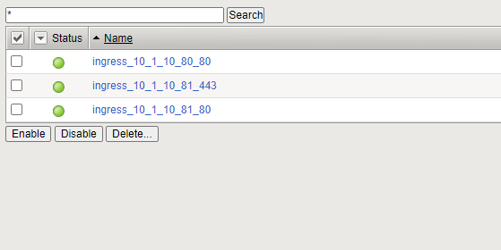
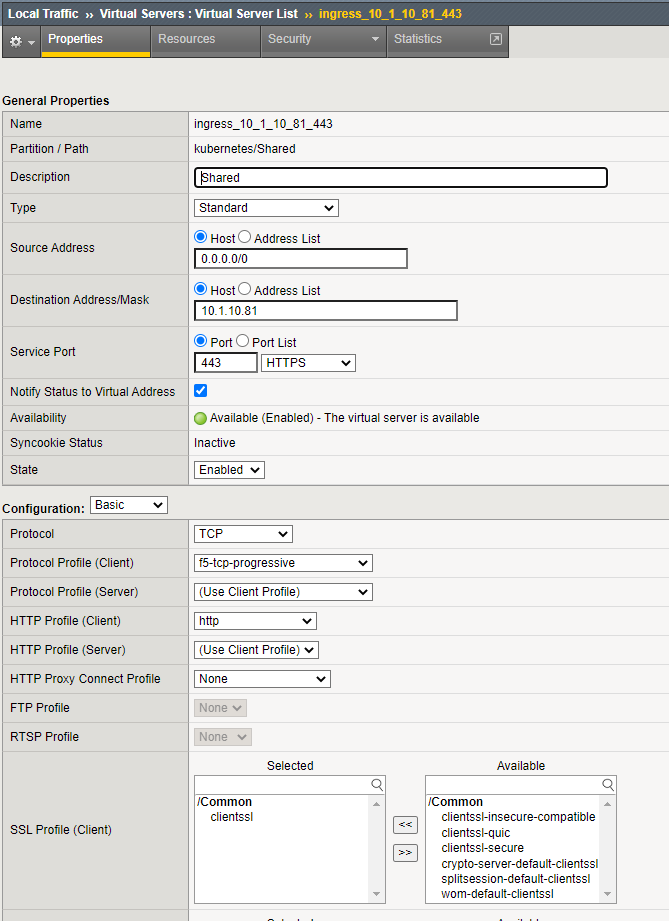

Basic Ingress Service - TLS
===========================

In this chapter we'll create basic ingress service - TLS encrypted to the client.

For this, we'll add another application (named **tea**) and add a second ingress service. We'll discover how to add certificate information to the service:
* by referencing a local certificate/ssl profile
* by adding a certificate from the k8s secret store

First, we'll add the application.

* Change to the app folder (/home/ubuntu/k8s/apps)::

   cd /home/ubuntu/k8s/apps

* Deploy the Application **tea-1** app & service::

   ubuntu@kube-master:~/k8s/apps$ kubectl apply -f tea-1.yaml
   deployment.apps/tea created
   service/tea-svc created

Now we can deploy the ingress service.

* Change to the ingress folder (/home/ubuntu/k8s/basic-ingress)::

   cd /home/ubuntu/k8s/basic-ingress

* Deploy ingress-tea-tls-1.yaml service::

   ubuntu@kube-master:~/k8s/basic-ingress$ kubectl apply -f ingress-tea-tls-1.yaml
   ingress.extensions/singleingress2 created

* And check if the service was created::

   ubuntu@kube-master:~/k8s/basic-ingress$ kubectl get ingress
   NAME             CLASS    HOSTS   ADDRESS      PORTS     AGE
   singleingress1   <none>   *       10.1.10.80   80        10h
   singleingress2   <none>   *       10.1.10.81   80, 443   57s

We enabled SSL encryption by adding annotations and adding a local SSL profile::
   
   [...]
      ingress.kubernetes.io/ssl-redirect: "true"
      # Allow/deny HTTP connections
      ingress.kubernetes.io/allow-http: "false"
      # Uncomment below annotation, to attach Server SSL Profile (local SSL profile)
      # virtual-server.f5.com/serverssl: "/Common/serverssl"
      # Custom monitor
      virtual-server.f5.com/health: '[{"path": "/", "send": "HTTP GET /", "interval": 5, "timeout": 10}]'
   spec:
   tls:
      # Specifies an already-configured SSL Profile on BIG-IP that should be
      # used for this Ingress.
      # Follows the format "/partition/profile_name".
      - secretName: /Common/clientssl
   [...]

Now check what happened on the bigip:

Virtual Server:

Ingress Service created on F5.

Check the SSL Profile:

Now we want to delete the ingress service again::

      ubuntu@kube-master:~/k8s/basic-ingress$ kubectl get ingress
      NAME             CLASS    HOSTS   ADDRESS      PORTS     AGE
      singleingress1   <none>   *       10.1.10.80   80        10h
      singleingress2   <none>   *       10.1.10.81   80, 443   8m6s
      
      ubuntu@kube-master:~/k8s/basic-ingress$ kubectl delete ingress singleingress2
      ingress.extensions "singleingress2" deleted

.. toctree::
   :numbered:
   :hidden:
   :caption: Chapter 3 - Ingress Service

   Introduction <k8s-ingress/introduction>
   Container Ingress Service <k8s-ingress/cis>
   Basic Ingress <k8s-ingress/basic-ingress>
   Basic Ingress - TLS <k8s-ingress/basic-ingress-tls>
   