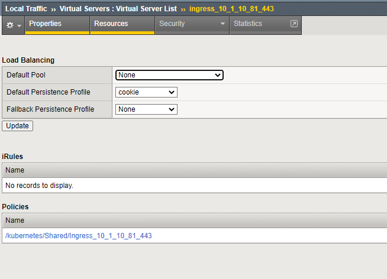

Basic Ingress Service - TLS
===========================

In this chapter we'll create basic ingress service - TLS encrypted to the client.

For this, we'll add another application (named **tea**) and add a second ingress service. We'll discover how to add certificate information to the service:
* by referencing a local certificate/ssl profile
* by adding a certificate from the k8s secret store

First, we'll add the application.

* Change to the app folder (/home/ubuntu/k8s/apps)::

   cd /home/ubuntu/k8s/apps

* Deploy the Application **tea-1** app & service::

   ubuntu@kube-master:~/k8s/apps$ kubectl apply -f tea-1.yaml
   deployment.apps/tea created
   service/tea-svc created

Basic TLS Service - ssl profile on the bigip
++++++++++++++++++++++++++++++++++++++++++++

Now we can deploy the ingress service.

* Change to the ingress folder (/home/ubuntu/k8s/basic-ingress)::

   cd /home/ubuntu/k8s/basic-ingress

* Deploy ingress-tea-tls-1.yaml service::

   ubuntu@kube-master:~/k8s/basic-ingress$ kubectl apply -f ingress-tea-tls-1.yaml
   ingress.extensions/singleingress2 created

* And check if the service was created::

   ubuntu@kube-master:~/k8s/basic-ingress$ kubectl get ingress
   NAME             CLASS    HOSTS   ADDRESS      PORTS     AGE
   singleingress1   <none>   *       10.1.10.80   80        10h
   singleingress2   <none>   *       10.1.10.81   80, 443   57s

We enabled SSL encryption by adding annotations and adding a local SSL profile::
   
   [...]
      ingress.kubernetes.io/ssl-redirect: "true"
      # Allow/deny HTTP connections
      ingress.kubernetes.io/allow-http: "false"
      # Uncomment below annotation, to attach Server SSL Profile (local SSL profile)
      # virtual-server.f5.com/serverssl: "/Common/serverssl"
      # Custom monitor
      virtual-server.f5.com/health: '[{"path": "/", "send": "HTTP GET /", "interval": 5, "timeout": 10}]'
   spec:
   tls:
      # Specifies an already-configured SSL Profile on BIG-IP that should be
      # used for this Ingress.
      # Follows the format "/partition/profile_name".
      - secretName: /Common/clientssl
   [...]

Now check what happened on the bigip:

Virtual Server:

Ingress Service created on F5.

Check the SSL Profile:

.. admonition:: secret vs. local profile

   DELETE the ingress service, as described below!!
   

Now we want to delete the ingress service again::

      ubuntu@kube-master:~/k8s/basic-ingress$ kubectl get ingress
      NAME             CLASS    HOSTS   ADDRESS      PORTS     AGE
      singleingress1   <none>   *       10.1.10.80   80        10h
      singleingress2   <none>   *       10.1.10.81   80, 443   8m6s
      
      ubuntu@kube-master:~/k8s/basic-ingress$ kubectl delete ingress singleingress2
      ingress.extensions "singleingress2" deleted

Login to the F5 and check if the service was removed.

Basic TLS Service - ssl profile deployed via secret
+++++++++++++++++++++++++++++++++++++++++++++++++++

Since the app already exists, we just have to add the cert and deploy an ingress service, pointing to a local secret store, instead of local bigip ssl profile.

* Change folder to cert secret config file(/home/ubuntu/k8s/basic-ingress/certificate)::

   cd /home/ubuntu/k8s/basic-ingress/certificate

* And deploy the Secret::

   ubuntu@kube-master:~/k8s/basic-ingress/certificate$ kubectl apply -f add-cert.yaml
   secret/ingress-example-secret-tls created

Now we can add the app, again.

* Change to folder /home/ubuntu/k8s/basic-ingress::

   ubuntu@kube-master:~/k8s/basic-ingress/certificate$ cd /home/ubuntu/k8s/basic-ingress
   ubuntu@kube-master:~/k8s/basic-ingress$

Deploy ingress-tea-tls-2.yaml service::

   ubuntu@kube-master:~/k8s/basic-ingress$ kubectl apply -f ingress-tea-tls-2.yaml
   ingress.extensions/singleingress8 created

If you have a look into the .yaml file, you'll find some interesting changes::

      spec:
      tls:
      - hosts:
         - mysite.foo.com
         #Referencing this secret in an Ingress tells the Ingress controller to
         #secure the channel from the client to the load balancer using TLS
         secretName: ingress-example-secret-tls
      rules:
         - host: www.adv-ingress.com
            http:
            # path to Service from URL
            paths:
            - path: /
               backend:
                  serviceName: coffee-svc

We add a L7 Routing Policy - as well as pointing to a local SSL Cert, instead of a local bigip profile.

.. admonition:: secret vs. local profile

   CIS controller will **always** lookup local secret store, before falling back to a local profile (but this is a configurable setting).

   In this example, CIS controller finds "ingress-example-secret-tls" in the local store and creates neccessary TLS profiles on f5.

   In the previous example, CIS controller couldn't find /Common/clientssl in the local store - and assumes this will be a local bigip p

Now check what happened on the bigip:

Virtual Server:

Ingress Service created on F5.

Check the SSL Profile:

We can see a "custom" LTM Profile attahed. You can go ahead and examine the cert/profile. For the purpose of this lab, we'll go ahead and check else has been added.
Check what happend with the "Host" port of the definition:

An LTM Policy was added - and within that policy, we check for the HTTP Host header and route traffic accordingly:

.. toctree::
   :numbered:
   :hidden:
   :caption: Chapter 3 - Ingress Service

   Introduction <k8s-ingress/introduction>
   Container Ingress Service <k8s-ingress/cis>
   Basic Ingress <k8s-ingress/basic-ingress>
   Basic Ingress - TLS <k8s-ingress/basic-ingress-tls>
   Basic Ingress - L7 Routing <k8s-ingress/basic-ingress-l7-route>
   