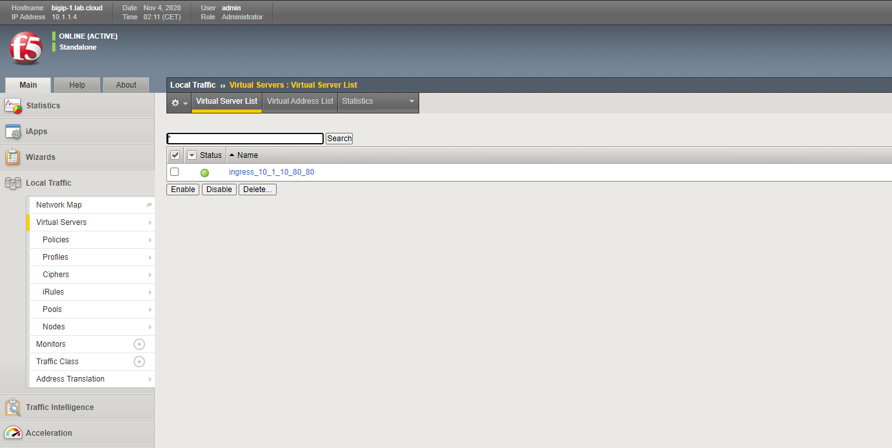
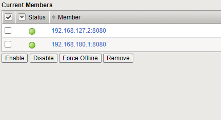
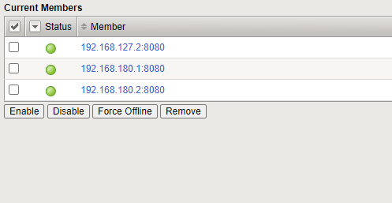

Basic Ingress Services
======================

Now that we created the controller, we can start creating services and ingress services.

First, and foremost, **update local github repository** (if not already done in a previous chapter)::

  ubuntu@kube-master:~$ /home/ubuntu/update_repo.sh
  A    k8s
  A    k8s/apps
  A    k8s/apps/README.md
  A    k8s/calico
  A    k8s/calico/README.md
  A    k8s/calico/calicoctl
  A    k8s/calico/calicoctl/BGPConfiguration
  A    k8s/calico/calicoctl/BGPPeer
  A    k8s/istio
  A    k8s/istio/README.md
  Exported revision 54.

The lenght of the list may vary, depending on the amout of scripts/files downloaded.

* First change folder to  /home/ubuntu/k8s/apps::

   cd /home/ubuntu/k8s/apps

|
|
Now we install the app. 
At the moment, we just install a plain web app. the link to the f5 will be done later. Also, we create a service, to make the app accessible.

* Install Service / App::

    kubectl apply -f k8s/apps/coffee-1.yaml

* And please check if the app is running::

    ubuntu@kube-master:~$ kubectl get pods
    NAME                      READY   STATUS    RESTARTS   AGE
    coffee-5f56ff9788-fp89s   1/1     Running   0          7s
    coffee-5f56ff9788-z8pqx   1/1     Running   0          7s

coffee-1 app AND service  looks as follows::

      apiVersion: apps/v1
      kind: Deployment
      metadata:
      name: coffee
      spec:
      replicas: 2
      selector:
         matchLabels:
            app: coffee
      template:
         metadata:
            labels:
            app: coffee
         spec:
            containers:
            - name: coffee
            image: nginxdemos/nginx-hello:plain-text
            ports:
            - containerPort: 8080
      ---
      apiVersion: v1
      kind: Service
      metadata:
      name: coffee-svc
      spec:
      ports:
      - port: 80
         targetPort: 8080
         protocol: TCP
         name: http
      selector:
         app: coffee

We installed a basic NGINX *coffee* app and make it accessible via port 8080

Now we can start announcing the service to the bigip. 
For this we need to create an ingress service - and, with the help of *annotations*, add f5 bigip specific config.

* Change folder to ingress-coffee-1.yaml::

      ubuntu@kube-master:~$ cd /home/ubuntu/k8s/basic-ingress
      ubuntu@kube-master:~/k8s/basic-ingress$

* Install Ingress::

    kubectl apply -f k8s/basic-ingress/ingress-coffee-1.yaml

* And check if ingress service was created::

      ubuntu@kube-master:~/k8s/basic-ingress$ kubectl get ingress
      NAME             CLASS    HOSTS   ADDRESS      PORTS   AGE
      singleingress1   <none>   *       10.1.10.80   80      8h

Ingress Service is created.

We added the service with following annotations::

   virtual-server.f5.com/ip: "10.1.10.80"
   virtual-server.f5.com/http-port: "80"
   virtual-server.f5.com/health: '[{"path": "/", "send": "HTTP GET /", "interval": 5, "timeout": 10}]'

This will add a Virtual Server:
* with IP *10.1.10.80*
* listening on port *80*
* an using a monitor to check */*. 

For a complete list of supported annotations (and default values), please check :ref:`clouddocs < https://clouddocs.f5.com/products/connectors/k8s-bigip-ctlr/latest/#supported-ingress-annotations>`

Now check what happened on the f5.
Login to BigIP, change to partition **kubernetes** and check the virtual server ...

Ingress Service created on F5.

Now check F5 Pool / Pool-Member:

Pool member is the Cluster IP of the POD.

Now let's add some dynamic. Try scaling the coffee application::

    ubuntu@kube-master:~$ kubectl scale --current-replicas=2 --replicas=3 deployment/coffee
    deployment.apps/coffee scaled

And check the Pool-Member again:

We just added a basic ingress service - and scaled the application from 2 to 3 pods. 
All this was monitored by the f5 CIS controller and dynamically updated on the bigip.

.. toctree::
   :numbered:
   :hidden:
   :caption: Chapter 3 - Ingress Service

   Introduction <k8s-ingress/introduction>
   Container Ingress Service <k8s-ingress/cis>
   Basic Ingress <k8s-ingress/basic-ingress>
   Basic Ingress - TLS <k8s-ingress/basic-ingress-tls>
   Basic Ingress - L7 Routing <k8s-ingress/basic-ingress-l7-route>